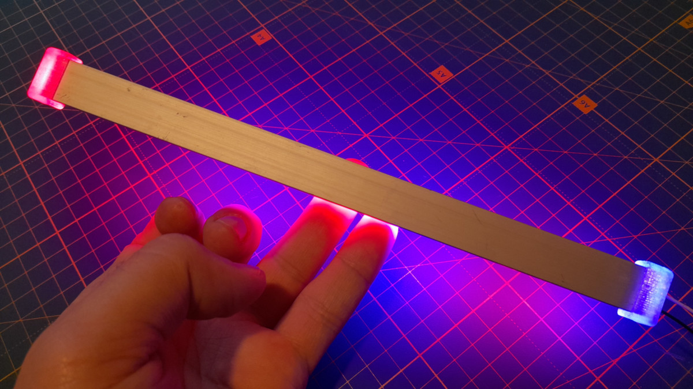

## Customizable Cap for a rectangular Pipes and LED-Profiles

    

⚠️ **In case of any questions** – do not hesitate to contact the author in Telegram group ([see below](#contact-me)) and ask.

## HOWTO

An example how it can be used for building a phyto lamp: https://youtu.be/X4Emjrqa19Q.

If you need the same size of caps as in the example above you can find the pre-built STL files here: https://www.thingiverse.com/thing:6593583.

In other case you have to configure OpenSCAD model for your needs.

## Contact me
To follow the progress go to my channels:
  - Telegram: [https://t.me/YarickWorkshop](https://t.me/YarickWorkshop/316)
  - YouTube: https://www.youtube.com/@yarick-workshop

Yeah, they both are in Russian.

**If you have any questions** – contact me in either Telegram channel (see above) or Mail: techno.man.983@gmail.com. I can communicate in English without any problems. 

⚠️ **Pay attention**: I do not answer to any comments on YouTube (despite I read them). Why? It is a HUGE secret 🙃